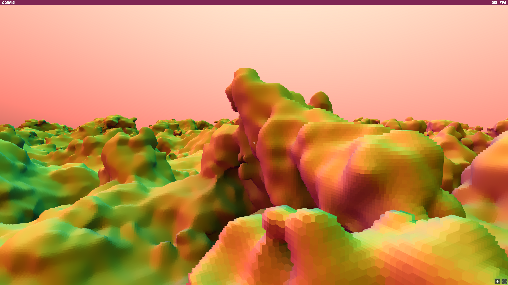
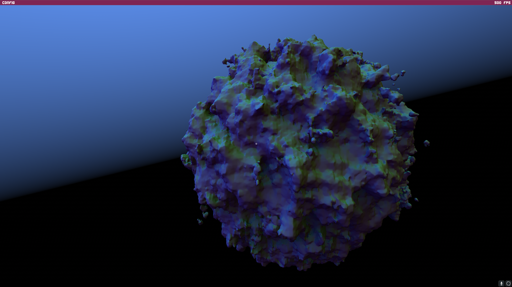
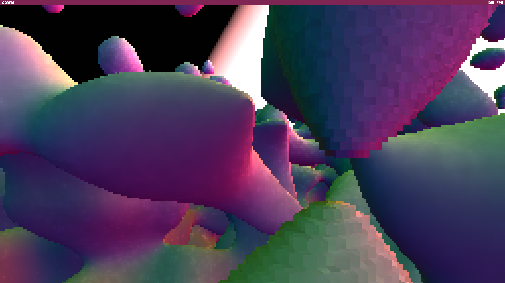
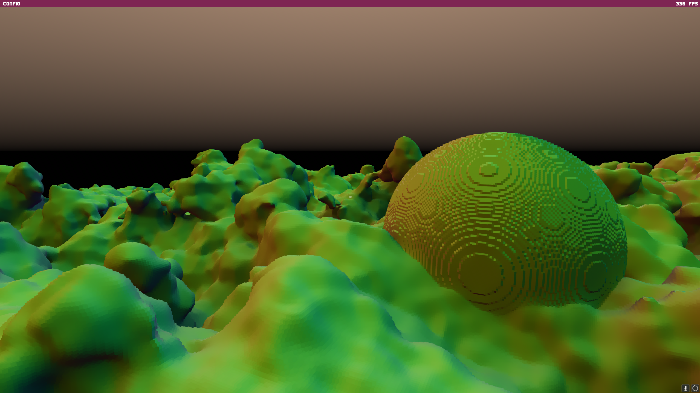

# Voxel Lab

This voxel tracing project is originally inspired by John Lin's work here [https://www.youtube.com/watch?v=UHzeQZD9t2s&t=34s]

# Roadmap

- [ ] Feat: Terrain dynamic editing
- [ ] Feat: Ocean
- [ ] Feat: Rastling grasses
- [ ] Feat: Better procedual generation https://www.youtube.com/watch?v=CSa5O6knuwI
- [ ] Fix: TAA flicker
- [ ] Feat: Clouds https://advances.realtimerendering.com/s2015/index.html

# Build this project

Currently, only windows build is supported.

git clone https://github.com/dannyHallo/voxel-lab.git

cd voxel-lab

./bootstrap.bat

To compile the project, you need to install the latest version of:
cmake,
Ninja,
clang,
ccache,
VulkanSDK (to support vulkan validation layer)

# Screenshots

# Features

- Procedual generation of a finite terrain scene
- Efficient Sparse Voxel Octree tracing for tracing inside every chunk.
- Branchless DDA algorithm for tracing into chunks.
- A simplified version of the A-SVGF denoiser
- Temporal sample accumulation
- TAA Upscaling
- Implementation of low discrepancy noise

# Hardware Requirements

This program can run on most GPUs that support Vulkan, since it only utilizes the compute shader utility.
You can check your GPU's support for Vulkan [here](https://vulkan.gpuinfo.org/).

# User Control

The user can control the camera scroll and roll angle by using the mouse as input. Additionally, the movement of the camera can be controlled using the following keys:

- **W**: Move the camera forward
- **A**: Move the camera left
- **S**: Move the camera backward
- **D**: Move the camera right
- **SPACE**: Move the camera up
- **CTRL**: Move the camera down

To unlock the mouse and control the terminal, the user can press the **TAB** key. This gives the user the ability to select the denoising techniques freely at run time. To lock the mouse again, the user can press **TAB** again.

To terminate the program, the user can press the **ESC** key.

## References

- https://alain.xyz/blog/tris-ray-tracing-filtering
- http://extremelearning.com.au/unreasonable-effectiveness-of-quasirandom-sequences
- https://psychopath.io/post/2014_06_28_low_discrepancy_sequences
