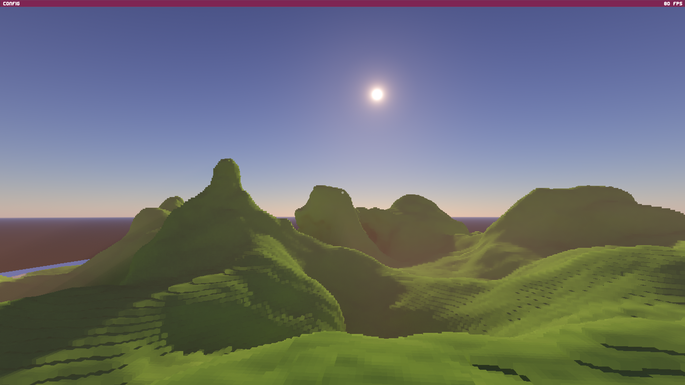

# Voxel Lab

This voxel tracing project is originally inspired by John Lin's awesome work

# Todos

- [ ] Feat: Ocean
- [ ] Feat: Rastling grasses
- [ ] Feat: Better procedual generation https://www.youtube.com/watch?v=CSa5O6knuwI
- [ ] Feat: Clouds https://advances.realtimerendering.com/s2015/index.html
- [ ] Fix: TAA flicker

# Build this project

Currently, only windows build is supported.

git clone https://github.com/dannyHallo/voxel-lab.git

cd voxel-lab

./bootstrap.bat

To compile the project, you need to install the latest version of:
cmake,
Ninja,
clang,
ccache,
VulkanSDK (to support vulkan validation layer)

# Screenshots

# Features

- Dynamic multi-scattering atmosphere
- Volumetric lighting for the sunlight
- Efficient Sparse Voxel Octree building and tracing
- Procedual generation of a finite voxelized terrain scene
- High performance dynamic terrain editing
- Branchless DDA algorithm for tracing into different SVO chunks
- A specialized version of the A-SVGF denoiser, optimized for voxelized scenes
- TAA Upscaling

# Hardware Requirements

This program can run on most GPUs that support Vulkan, since it only utilizes the compute shader utility.
You can check your GPU's support for Vulkan [here](https://vulkan.gpuinfo.org/).

# User Control

The user can control the camera scroll and roll angle by using the mouse as input. Additionally, the movement of the camera can be controlled using the following keys:

- **W**: Move the camera forward
- **A**: Move the camera left
- **S**: Move the camera backward
- **D**: Move the camera right
- **SPACE**: Move the camera up
- **CTRL**: Move the camera down
- **E**: Toggle setting mode

## References

- https://alain.xyz/blog/tris-ray-tracing-filtering
- http://extremelearning.com.au/unreasonable-effectiveness-of-quasirandom-sequences
- https://psychopath.io/post/2014_06_28_low_discrepancy_sequences
